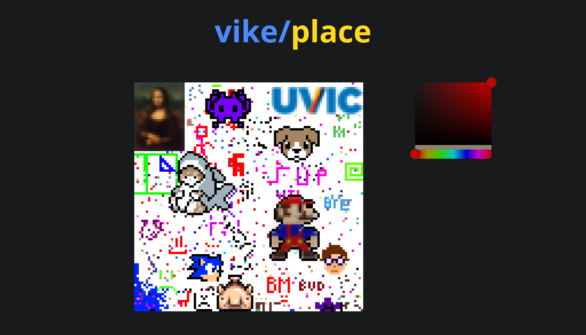

# vike/place

`vike/place` is an [`r/place`](https://www.reddit.com/r/place/)-like collaborative pixel art game, where users can work cooperatively or competitively to draw whatever they like. We felt that `vike/place` really embodies the spirit of realtime applications, since the nature is very apparent in a competitive environment.



## Technology

Our frontend is an SPA written in React. Our team was most familiar with this tool, and that was a major deciding factor in using it. We use the built-in browsero [WebSocket API](https://developer.mozilla.org/en-US/docs/Web/API/WebSocket) for communication with the backend, and use [Zod](https://zod.dev/) for schema validation to prevent errors at the network boundary. We used [p5.js](https://p5js.org/) for rendering to a canvas element, which is where the game lives. We also used [react-colorful](https://omgovich.github.io/react-colorful/) for a more user-friendly color picker. This was all of our dependencies, and we specifically avoided more heavy-weight frameworks like Redux, Nextjs, etc to improve iteration time and flexibility. We use [Vite](https://vitejs.dev/) as our bundler, outputting minified HTML, CSS, and JavaScript to a directory for static hosting.

Our backend is written in Rust, using the [Axum](https://github.com/tokio-rs/axum) web server running on the [Tokio](https://tokio.rs/) async runtime. We anticipate the application to be I/O-bound, and latency is very important for an online game, and the Tokio runtime has been [used by companies like Cloudflare](https://blog.cloudflare.com/how-we-built-pingora-the-proxy-that-connects-cloudflare-to-the-internet/) to meet similar requirements. JSON over Websockets were used for communication, since they're easy to implement and the browser ships with tools to work with them.

Our protocol was designed to minimize network traffic, so it only sends the entire board when you first connect, and afterwards only sends the most recent changes. The backend stores all state in memory for maximum performance, and applies changes in-place as messages come in from clients. Since all state lives on the server, clients can refresh the page or lose connectivity and not lose data.

Our app is deployed as a collection of static files for the frontend, and as a single binary for the backend. This makes deployment very easy, since copying files to the server is all it takes. We put it in Docker anyway to make it even more trivial.

Overall, we're very happy with the result of our application. We do have some regrets with using p5.js, since it's a thin abstraction around Canvas and we could have a better website without it.

## Local Development

> [!NOTE]
> **BEFORE** you run the following steps make sure you have [`docker`](https://docs.docker.com/engine/install/) & the [`docker compose`](https://docs.docker.com/compose/install/#scenario-two-install-the-compose-plugin) plugin installed and running

```shell
git clone https://github.com/kylestang/uvec-summer-2024 && cd uvec-summer-2024

docker compose up --build
```

The development environment is now running and accessible at [http://localhost:8080](http://localhost:8080/)
